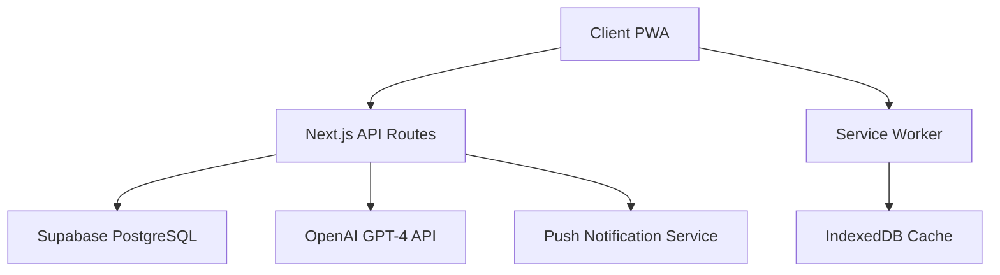

# Sweethearty

[](http://creativecommons.org/licenses/by-nc-sa/4.0/)
[](https://www.typescriptlang.org/)
[](https://nextjs.org/)
[](https://supabase.com/)
[](https://openai.com/)
[](https://web.dev/progressive-web-apps/)

**An AI-powered progressive web application for meal tracking with personalized encouragement and habit building**

---

## 🎯 Overview

My Progress Planner is an enterprise-grade progressive web application that transforms meal tracking from a mundane task into an engaging, supportive experience. Built with modern web technologies and powered by AI, it provides users with personalized feedback while maintaining complete privacy and data sovereignty.

### Key Value Propositions

- **AI-Driven Engagement**: GPT-4 powered responses provide contextual, encouraging feedback
- **Progressive Web App**: Native app experience with offline-first architecture
- **Privacy-First Design**: Complete user data isolation with row-level security
- **Scalable Architecture**: Built for high availability and horizontal scaling
- **Modern Tech Stack**: Leverages industry-leading technologies for optimal performance

---

## 🏗️ Technical Architecture

### System Overview



### Technology Stack

| Layer | Technology | Version | Purpose |
|-------|------------|---------|---------|
| **Frontend** | Next.js | 14.x | React framework with App Router |
| **Language** | TypeScript | 5.x | Type-safe development |
| **Styling** | Tailwind CSS | 3.x | Utility-first CSS framework |
| **Animation** | Framer Motion | 11.x | Production-ready motion library |
| **Database** | Supabase (PostgreSQL) | Latest | Real-time database with auth |
| **Authentication** | Supabase Auth | Latest | OAuth 2.0 + JWT tokens |
| **AI Engine** | OpenAI GPT-4 | Latest | Natural language processing |
| **State Management** | React Hooks + Context | - | Client-side state management |
| **PWA** | Workbox + Next.js | Latest | Service worker and caching |
| **Deployment** | Vercel | Latest | Edge computing platform |

---

## 🚀 Quick Start

### Prerequisites

Ensure you have the following installed and configured:

- **Node.js** ≥ 18.17.0 (LTS recommended)
- **npm** ≥ 9.0.0 or **yarn** ≥ 1.22.0
- **Git** for version control
- **Supabase** project with PostgreSQL database
- **OpenAI** API account with GPT-4 access

### Development Setup

1. **Clone and Install**
   ```bash
   git clone https://github.com/dinesh-git17/my-progress-planner.git
   cd my-progress-planner
   npm install
   ```

2. **Environment Configuration**
   
   Copy the example environment file:
   ```bash
   cp .env.example .env.local
   ```

   Configure the following environment variables:
   ```env
   # Database & Authentication
   NEXT_PUBLIC_SUPABASE_URL=https://your-project.supabase.co
   NEXT_PUBLIC_SUPABASE_ANON_KEY=your_anon_key
   SUPABASE_SERVICE_ROLE_KEY=your_service_role_key
   
   # AI Integration
   OPENAI_API_KEY=sk-your_openai_api_key
   
   # Security (Production)
   CRON_SECRET=your_secure_random_string
   ADMIN_PASSWORD=your_secure_admin_password
   
   # Push Notifications (Optional)
   VAPID_PUBLIC_KEY=your_vapid_public_key
   VAPID_PRIVATE_KEY=your_vapid_private_key
   PUSH_CONTACT_EMAIL=mailto:your_email@domain.com
   ```

3. **Database Setup**
   
   Run the database migrations:
   ```bash
   npm run db:setup
   ```

4. **Development Server**
   ```bash
   npm run dev
   ```

   Access the application at `http://localhost:3000`

### Production Deployment

#### Vercel (Recommended)

[](https://vercel.com/new/clone?repository-url=https://github.com/dinesh-git17/my-progress-planner)

1. Connect your GitHub repository to Vercel
2. Configure environment variables in Vercel dashboard
3. Deploy with automatic CI/CD on every push

#### Manual Deployment

```bash
npm run build
npm run start
```

---

## 📊 Core Features & Architecture

### Authentication & Security

- **Multi-Provider OAuth**: Google, GitHub, email/password
- **JWT Token Management**: Automatic refresh with secure storage
- **Row-Level Security (RLS)**: Database-level user isolation
- **CSRF Protection**: Built-in Next.js security features
- **Rate Limiting**: API endpoint protection against abuse

### Data Management

#### Database Schema

```sql
-- Core user profiles
CREATE TABLE users (
  id UUID PRIMARY KEY DEFAULT gen_random_uuid(),
  email TEXT UNIQUE NOT NULL,
  name TEXT,
  friend_code TEXT UNIQUE,
  created_at TIMESTAMP WITH TIME ZONE DEFAULT now(),
  updated_at TIMESTAMP WITH TIME ZONE DEFAULT now()
);

-- Meal tracking entries
CREATE TABLE meals (
  id UUID PRIMARY KEY DEFAULT gen_random_uuid(),
  user_id UUID REFERENCES users(id) ON DELETE CASCADE,
  meal_type meal_type_enum NOT NULL,
  content TEXT NOT NULL,
  ai_response TEXT,
  logged_at TIMESTAMP WITH TIME ZONE DEFAULT now(),
  created_at TIMESTAMP WITH TIME ZONE DEFAULT now()
);

-- Daily AI summaries
CREATE TABLE summaries (
  id UUID PRIMARY KEY DEFAULT gen_random_uuid(),
  user_id UUID REFERENCES users(id) ON DELETE CASCADE,
  summary_date DATE NOT NULL,
  content TEXT NOT NULL,
  meals_count INTEGER DEFAULT 0,
  created_at TIMESTAMP WITH TIME ZONE DEFAULT now(),
  UNIQUE(user_id, summary_date)
);
```

#### Data Flow

1. **Client Input** → Form validation → API endpoint
2. **Server Processing** → Database operation → AI processing (if applicable)
3. **Response Generation** → Client update → PWA cache sync

### AI Integration

#### Response Generation Pipeline

```typescript
interface AIResponse {
  content: string;
  context: {
    mealType: 'breakfast' | 'lunch' | 'dinner';
    streak: number;
    previousMeals: Meal[];
    userPreferences: UserPreferences;
  };
  metadata: {
    tokens: number;
    model: string;
    timestamp: string;
  };
}
```

#### Context-Aware Features

- **Streak Recognition**: Celebrates consistency milestones
- **Meal Pattern Analysis**: Identifies healthy habits and improvements
- **Time-Sensitive Responses**: Different encouragement based on meal timing
- **Personalization**: Learns from user interaction patterns

### Progressive Web App Capabilities

#### Service Worker Architecture

- **Cache-First Strategy**: Static assets and shell resources
- **Network-First Strategy**: API calls with offline fallback
- **Background Sync**: Queue operations when offline
- **Push Notifications**: Optional engagement features

#### Offline Functionality

- Complete meal logging interface
- Local data persistence with IndexedDB
- Automatic sync when connection restored
- Conflict resolution for concurrent updates

---

## 🧪 Testing & Quality Assurance

### Testing Strategy

```bash
# Unit Tests
npm run test

# Integration Tests  
npm run test:integration

# E2E Tests
npm run test:e2e

# Type Checking
npm run type-check

# Linting
npm run lint

# Performance Audit
npm run lighthouse
```

### Quality Metrics

- **Test Coverage**: >90% for critical business logic
- **Type Safety**: 100% TypeScript coverage
- **Performance**: Lighthouse score >95
- **Accessibility**: WCAG 2.1 AA compliance
- **Security**: Regular dependency audits

---

## 📈 Performance & Scalability

### Optimization Features

- **Image Optimization**: Next.js automatic optimization
- **Code Splitting**: Route-based and component-based
- **Tree Shaking**: Automatic dead code elimination
- **Compression**: Gzip/Brotli compression enabled
- **CDN Integration**: Global edge caching

### Monitoring & Analytics

- **Real User Monitoring (RUM)**: Core Web Vitals tracking
- **Error Tracking**: Comprehensive error reporting
- **Performance Metrics**: API response times and database queries
- **User Analytics**: Privacy-compliant usage analytics

---

## 🚦 Development Workflow

### Branch Strategy

- `main` - Production-ready code
- `develop` - Integration branch for features  
- `feature/*` - Individual feature development
- `hotfix/*` - Critical production fixes

### Code Quality

```bash
# Pre-commit hooks
npm run pre-commit

# Automated formatting
npm run format

# Comprehensive linting
npm run lint:strict
```

### Continuous Integration

```yaml
# .github/workflows/ci.yml
name: CI/CD Pipeline
on: [push, pull_request]
jobs:
  test:
    runs-on: ubuntu-latest
    steps:
      - uses: actions/checkout@v4
      - name: Setup Node.js
        uses: actions/setup-node@v4
        with:
          node-version: '18'
      - run: npm ci
      - run: npm run type-check
      - run: npm run lint
      - run: npm run test
      - run: npm run build
```

---

## 🤝 Contributing

We welcome contributions that align with our mission of creating supportive, privacy-focused user experiences.

### Development Guidelines

1. **Fork the repository** and create your feature branch
2. **Follow TypeScript best practices** and maintain type safety
3. **Write comprehensive tests** for new functionality
4. **Ensure accessibility compliance** (WCAG 2.1 AA)
5. **Maintain the supportive tone** in user-facing features
6. **Document API changes** and update relevant documentation

### Pull Request Process

1. Update documentation for any new features
2. Ensure all tests pass and coverage remains >90%
3. Add screenshots for UI changes
4. Request review from maintainers
5. Address feedback and maintain clean commit history

---

## 📋 API Documentation

### Core Endpoints

| Endpoint | Method | Purpose | Auth |
|----------|--------|---------|------|
| `/api/auth/callback` | GET | OAuth callback handling | Public |
| `/api/meals` | GET/POST | Meal CRUD operations | Required |
| `/api/summaries` | GET | Daily summary retrieval | Required |
| `/api/ai/chat` | POST | AI response generation | Required |
| `/api/admin/stats` | GET | System statistics | Admin |

### Response Format

```typescript
interface APIResponse<T> {
  data: T | null;
  error: string | null;
  meta?: {
    total: number;
    page: number;
    limit: number;
  };
}
```

---

## 🛡️ Security & Privacy

### Security Measures

- **HTTPS Everywhere**: Strict transport security
- **Content Security Policy**: XSS protection
- **CORS Configuration**: Restricted origin access
- **Input Validation**: Server-side sanitization
- **SQL Injection Prevention**: Parameterized queries

### Privacy Compliance

- **Data Minimization**: Collect only necessary information
- **User Consent**: Clear opt-in for optional features
- **Data Portability**: Export functionality available
- **Right to Deletion**: Complete data removal option
- **Anonymization**: No PII in analytics

---

## 📞 Support & Maintenance

### Documentation

- **API Documentation**: `/docs/api`
- **Architecture Guide**: `/docs/architecture.md`
- **Deployment Guide**: `/docs/deployment.md`
- **Contributing Guide**: `/CONTRIBUTING.md`

---

## 📄 License

This project is licensed under the Creative Commons Attribution-NonCommercial-ShareAlike 4.0 International License. See the [LICENSE.md](LICENSE.md) file for details.

### Commercial Usage

For commercial licensing options, please contact me at `dineshddawo@gmail.com`.

---

## 🙏 Acknowledgments

- **OpenAI** for providing the GPT-4 API that powers our AI features
- **Supabase** for the robust backend infrastructure
- **Vercel** for the exceptional deployment platform
- **The Next.js team** for the outstanding React framework

---

<div align="center">

**Built with ❤️ for people who deserve encouragement on their wellness journey**

[🌐 Live Demo](https://sweethearty.app) • [📖 Documentation]() • [🐛 Report Bug](https://github.com/dinesh-git17/my-progress-planner/issues)

</div>
